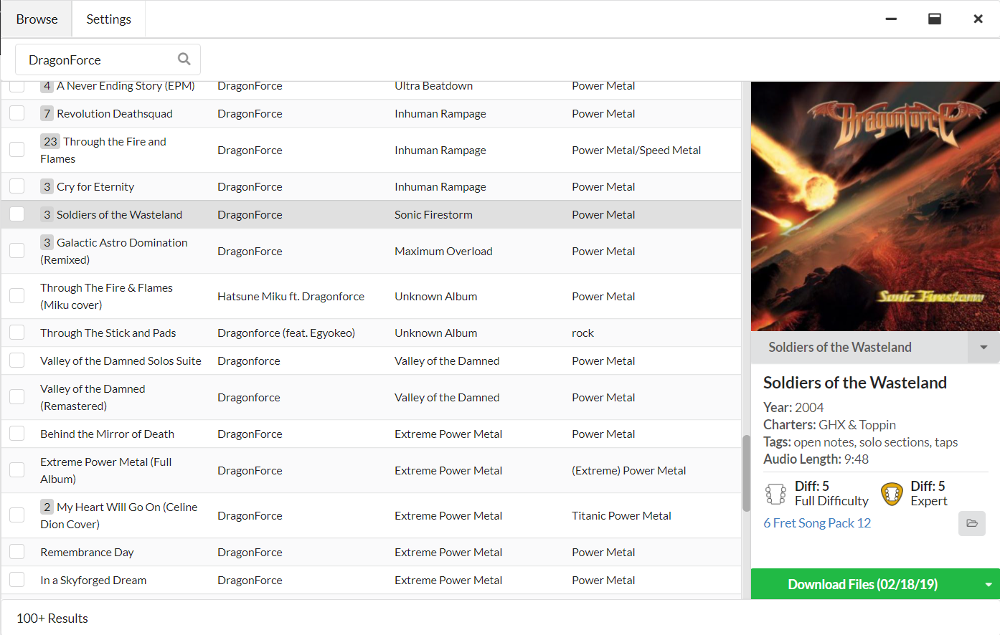

<p align="center">
  
</p>
<h3 align="center">A rhythm game chart searching and downloading tool.</h3>

<hr>

**Bridge** is a desktop application that allows you to search for and download charts that can be played in  games like Clone Hero, YARG, etc...

This is the desktop version of [Chorus Encore](https://www.enchor.us/).

## Setup

Head over to the [Releases](https://github.com/Geomitron/Bridge/releases) page to download the install wizard. (Windows 10/11, Mac, and Linux versions are available)

## Features

- ✅ Find all charts that can be found on Chorus Encore.
- ✅ Download any chart directly into your chart library as a chart folder or `.sng` file.
- ✅ Multi-select songs to add to the download queue.
- ✅ Cancel and retry downloads.
- ✅ In-app update checking and downloading.
- ✅ A variety of themes.
- ✅ Advanced song search.
- ✅ Chart issue scanner (for people making charts).

### What's new in v3.1.0

v3.0.0

- Add "Tools" tab with chart issue scanner

### Development

Built using Node.js, Angular, and Electron.

Learn how to install Node.js [here](https://nodejs.dev/en/download/)

After installing Node.js and cloning the repository, install dependencies and run development with:

```
$ npm install -g pnpm
$ pnpm install && pnpm start
```

### Socials

To discuss the project and make suggestions, please join the [Discord](https://discord.gg/cqaUXGm)

To help me pay for the server costs, please check out the [Patreon](https://www.patreon.com/ChorusEncore701)
