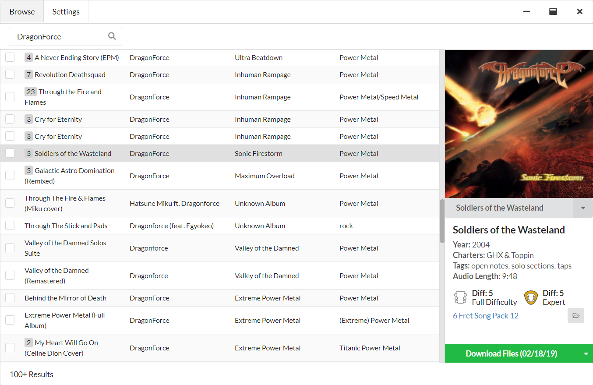

<p align="center">
  
</p>
<h3 align="center">A Clone Hero library management tool with built in chart searching and downloading.</h3>

<p align="center">
  <a href="https://discord.gg/cqaUXGm">Discord</a> | 
  <a href="https://trello.com/b/lz8MvNhF/bridge">Trello</a>
</p>
<hr>

**Bridge** is a desktop application that helps CloneHero players browse, find, download, and extract new charts very quickly and eaisly.

## Features

- ✅ Find all charts that can be found on Chorus.
- ✅ Download and extract any chart directly into your chart library.
- ✅ Multi-select songs to add to the download queue.
- ✅ Cancel and retry downloads.
- ✅ Google Authentication to avoid rate limited downloads.
- ✅ In-app update checking and downloading.
- ⚠️ Theme support.
- ❌ Advanced song search.
- ❌ Scan and fix certain metadata problems in your chart library.
- ❌ Easily download the most up-to-date versions of charts in your library.

Key:

- ✅ Complete
- ⚠️ In progress
- ❌ Not yet started

### Development

Built using Node.js, Angular, and Electron.

After installing Node.js and cloning the repository, install dependencies and run development with:

```
$ npm install && npm start
```