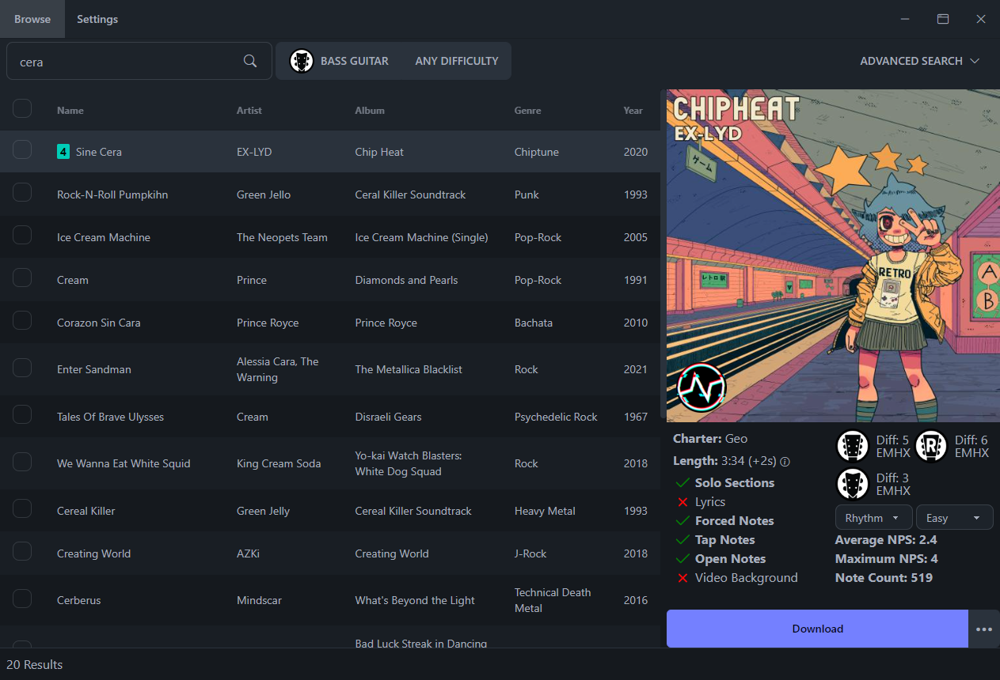

<p align="center">
  
</p>
<h3 align="center">A rhythm game chart searching and downloading tool.</h3>

<hr>

**Bridge** is a desktop application that allows you to search for and download charts that can be played in  games like Clone Hero, YARG, etc...

This is the desktop version of [Chorus Encore](https://www.enchor.us/).

## Setup

Head over to the [Releases](https://github.com/Geomitron/Bridge/releases) page to download the install wizard. (Windows, Mac, and Linux versions are available)

## Features

- ✅ Find all charts that can be found on Chorus Encore.
- ✅ Download any chart directly into your chart library as a chart folder or `.sng` file.
- ✅ Multi-select songs to add to the download queue.
- ✅ Cancel and retry downloads.
- ✅ In-app update checking and downloading.
- ✅ A variety of themes.
- ✅ Advanced song search.

### What's new in v2.0.0

v.2.0.0

- Update to Angular 17
- Update to Electron 27
- Refreshed visual style, with 12 themes supported
- Search results now update as you type
- Improved search result accuracy in various cases
- Added persistent instrument and difficulty filters
- Reworked advanced search to include more options
- Search result table now has a "compact" view option
- Search result table now shows latest charts by default
- Searches now display the total number of results
- Added the charter or setlist icon on top of the album art
- Reworked chart details display to include more chart information
- Added button to report issues with charts
- Fixed a variety of issues causing some charts to not download
- Download speed and reliability has been significantly improved
- Chart audio is automatically converted to .opus (older CH versions don't support this)
- Added option to download charts as .sng files (a new format currently only supported by CH v1.1 and YARG)
- The list of available charts will now update much more frequently and reliably

#### Known Issues:
- Chart folders download more slowly than .sng files
- There are rare cases where the download audio is heavily distorted (for now, redownload it from the Google Drive source folder manually)


### Development

Built using Node.js, Angular, and Electron.

Learn how to install Node.js [here](https://nodejs.dev/en/download/)

After installing Node.js and cloning the repository, install dependencies and run development with:

```
$ npm install -g pnpm
$ pnpm install && pnpm start
```

### Socials

To discuss the project and make suggestions, please join the [Discord](https://discord.gg/cqaUXGm)
